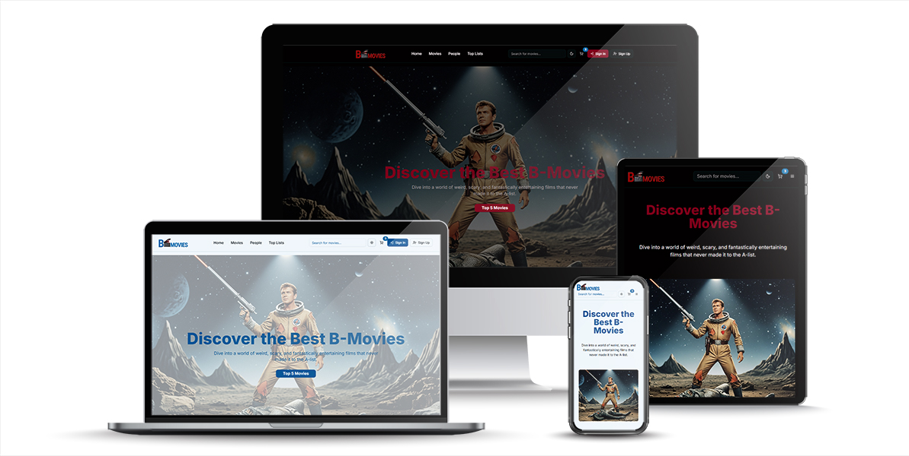

# MovieShop Beta 🎬

A modern movie e-commerce platform built with Next.js, featuring user authentication, shopping cart functionality, and a responsive design.



**Created by:** Josefine, Niklas & Amina

## 📋 Table of Contents

- [Features](#features)
- [Tech Stack](#tech-stack)
- [Getting Started](#getting-started)
- [Project Structure](#project-structure)
- [Components](#components)
- [Authentication](#authentication)
- [Usage](#usage)
- [Team](#team)
- [Contributing](#contributing)

## ✨ Features

- **🎭 Movie Browsing**: Browse and search through a comprehensive movie database
- **🔐 User Authentication**: Sign up and sign in functionality with secure authentication
- **🛒 Shopping Cart**: Add movies to cart and manage purchases
- **📱 Responsive Design**: Fully responsive navbar and UI components
- **🌙 Dark/Light Mode**: Theme toggle for better user experience
- **🔍 Search Functionality**: Search for movies across the platform
- **👤 User Profiles**: User profile management with dropdown menu
- **📊 Top Lists**: Curated lists of latest, popular, oldest, and cheapest movies

## 🛠 Tech Stack

- **Framework**: [Next.js](https://nextjs.org/) (React)
- **Language**: TypeScript
- **Styling**: [Tailwind CSS](https://tailwindcss.com/)
- **UI Components**: [shadcn/ui](https://ui.shadcn.com/)
- **Form Handling**: [React Hook Form](https://react-hook-form.com/)
- **Validation**: [Zod](https://zod.dev/)
- **Icons**: [Lucide React](https://lucide.dev/)
- **Authentication**: Custom auth client
- **Theme**: [next-themes](https://github.com/pacocoursey/next-themes)

## 🚀 Getting Started

### Prerequisites

- Node.js 18+
- npm or yarn

### Installation

1. **Clone the repository**

   ```bash
   git clone <repository-url>
   cd movieshop-beta
   ```

2. **Install dependencies**

   ```bash
   npm install
   # or
   yarn install
   ```

3. **Run the development server**

   ```bash
   npm run dev
   # or
   yarn dev
   ```

4. **Open your browser**
   Navigate to [http://localhost:3000](http://localhost:3000)

## 📁 Project Structure

movieshop-beta/
├── .next/ # Next.js build output (auto-genererad)
├── .vscode/ # VS Code workspace inställningar
├── node_modules/ # NPM dependencies (auto-installerad)
├── prisma/ # Databas schema och migrationer
│ ├── dev.db # SQLite databas fil
│ ├── schema.prisma # Prisma schema definition
│ └── migrations/ # Databas migrationer
│ ├── migration_lock.toml # Migration lock fil
│ ├── 20250918215617_init_sqlite/
│ └── 20250918222825_add_customer_fields/
├── public/ # Statiska filer (bilder, ikoner)
│ └── images/ # App bilder och placeholders
├── src/ # Applikationens källkod
│ ├── actions/ # Server Actions för datahantering
│ │ ├── api-actions.ts # Allmänna API operationer
│ │ ├── cookie-cart.ts # Legacy cart actions (ersatt av /cart/)
│ │ ├── genres.ts # Genre CRUD operationer
│ │ ├── movies.ts # Film CRUD operationer
│ │ ├── orders.ts # Order hantering
│ │ └── person.ts # Person/skådespelare operationer
│ ├── app/ # Next.js App Router struktur
│ │ ├── aboutus/ # Om oss sida
│ │ ├── admin/ # Admin panel för CRUD
│ │ │ ├── genres/ # Genre administration
│ │ │ ├── movies/ # Film administration
│ │ │ ├── orders/ # Order administration
│ │ │ └── person/ # Person administration
│ │ ├── api/ # API routes
│ │ │ ├── auth/ # Autentisering endpoints
│ │ │ └── cart/ # Legacy cart API (ersatt av server actions)
│ │ │ └── route.ts # REST endpoint för cart
│ │ ├── checkout/ # Checkout flöde
│ │ │ ├── success/[orderId]/ # Order framgångssida
│ │ │ │ └── page.tsx # Tackmeddelande med orderdetaljer
│ │ │ └── page.tsx # Checkout formulär
│ │ ├── movies/ # Film browsing
│ │ │ ├── page.tsx # Film listing med filter/sökning
│ │ │ └── [movieId]/ # Individuell film sida
│ │ ├── person/ # Person/skådespelare sidor
│ │ │ ├── page.tsx # Person listing
│ │ │ └── [personId]/ # Individuell person sida
│ │ ├── sign-in/ # Inloggning
│ │ ├── sign-up/ # Registrering
│ │ ├── user/ # Användarprofil och orderhistorik
│ │ ├── favicon.ico # Webbplats ikon
│ │ ├── globals.css # Globala CSS stilar
│ │ ├── layout.tsx # Root layout med navbar/footer
│ │ └── page.tsx # Startsida med hero och carousels
│ ├── cart/ # Cookie-baserad cart system (NY)
│ │ ├── actions.ts # Server actions för cart operationer
│ │ ├── constants.ts # Cart konstanter och typer
│ │ ├── cookie.ts # Cookie hantering för cart
│ │ └── math.ts # Cart beräkningar (totaler etc)
│ ├── checkout/ # Checkout logik (NY)
│ │ └── actions.ts # Order submission med gäst/user support
│ ├── components/ # Återanvändbara React komponenter
│ │ ├── forms/ # Formulär komponenter
│ │ │ ├── create-genre-form.tsx # Admin genre formulär
│ │ │ ├── create-movies-form.tsx # Admin film formulär
│ │ │ ├── create-order-form.tsx # Admin order formulär
│ │ │ ├── create-person-form.tsx # Admin person formulär
│ │ │ ├── sign-in-form.tsx # Inloggnings formulär
│ │ │ ├── sign-up-form.tsx # Registrerings formulär
│ │ │ ├── update-movie-form.tsx # Film uppdatering
│ │ │ └── update-person-form.tsx # Person uppdatering
│ │ ├── ui/ # Grundläggande UI komponenter (shadcn/ui)
│ │ ├── button-signin-signout.tsx # Auth status button
│ │ ├── card-movies.tsx # Film kort för listings
│ │ ├── card-person.tsx # Person kort för listings
│ │ ├── cart-quantity-buttons.tsx # Kvantitet +/- knappar
│ │ ├── cart-remove-button.tsx # Ta bort från cart knapp
│ │ ├── edit-movie-popup.tsx # Quick edit popup för filmer
│ │ ├── footer.tsx # Sidfot
│ │ ├── genre-filter.tsx # Genre filtering
│ │ ├── home-carousels.tsx # Startsidans film karuseller
│ │ ├── home-hero-section.tsx # Hero sektion på startsida
│ │ ├── movie-carousel.tsx # Film karusell komponent
│ │ ├── movie-details.tsx # Film detaljer vy
│ │ ├── navbar.tsx # Navigations bar
│ │ ├── person-carousel.tsx # Person karusell
│ │ ├── person-details.tsx # Person detaljer vy
│ │ ├── search-bar.tsx # Sök funktionalitet
│ │ ├── shopping-cart-sheet.tsx # Slide-out cart panel
│ │ ├── sort-picker.tsx # Sortering controls
│ │ ├── theme-provider.tsx # Dark/light mode provider
│ │ └── toggle-theme-button.tsx # Theme växlings knapp
│ ├── generated/ # Auto-genererad kod
│ │ └── prisma/ # Prisma client kod
│ └── lib/ # Hjälpfunktioner och konfiguration
│ ├── auth-client.ts # Better Auth client config
│ ├── auth.ts # Better Auth server config
│ ├── prisma.ts # Prisma client instans
│ ├── tmdb-image-url.ts # TMDB bild URL helpers
│ ├── tmdb.ts # TMDB API integration
│ ├── types.ts # TypeScript type definitions
│ ├── utils.ts # Allmänna utility funktioner
│ └── zod-schemas.ts # Zod validation schemas
├── .env # Miljövariabler (databas URL, API nycklar)
├── .gitignore # Git ignore regler
├── components.json # shadcn/ui konfiguration
├── eslint.config.mjs # ESLint regler
├── LICENSE # Licens fil
├── next-env.d.ts # Next.js TypeScript definitions
├── next.config.ts # Next.js konfiguration
├── package-lock.json # NPM dependency lock
├── package.json # NPM dependencies och scripts
├── postcss.config.mjs # PostCSS konfiguration
├── README.md # Projekt dokumentation
└── tsconfig.json # TypeScript konfiguration

## 🧩 Components

### Navbar

- **Desktop Navigation**: Home, Movies, People, Top Lists
- **Mobile Navigation**: Collapsible hamburger menu with authentication forms
- **Search Bar**: Global movie search functionality (always visible)
- **Theme Toggle**: Dark/light mode switcher
- **Shopping Cart**: Cart management
- **Authentication**:
  - Desktop: ProfileDropdown and Sign Up button
  - Mobile: Sign In/Up buttons in hamburger menu with modal forms

### Authentication Forms

- **Sign In Form**: Email and password authentication with popup modal
- **Sign Up Form**: User registration with validation in popup modal
- **Profile Dropdown**: User menu with profile options (desktop only)

### Responsive Design

- **Desktop**: Full navigation with profile dropdown and sign up button
- **Mobile**: Hamburger menu with sign in/up options in modal dialogs
- **Search**: Always visible on both desktop and mobile
- **Adaptive UI**: Different layouts optimized for each screen size

## 🔐 Authentication

The application uses a custom authentication system with:

- **Email/Password Authentication**: Secure sign up and sign in
- **Form Validation**: Zod schema validation for all forms
- **Session Management**: Automatic redirect after authentication
- **Profile Management**: User profile dropdown with settings
- **Responsive Auth UI**: Different authentication flows for desktop and mobile

### Authentication Flow

1. **Sign Up**: New users create account with name, email, and password
2. **Sign In**: Existing users authenticate with email and password
3. **Profile Access**: Authenticated users see profile dropdown instead of auth buttons
4. **Logout**: Users can sign out from the profile dropdown

## 📱 Usage

### For Visitors (Not Logged In)

- Browse movies and search functionality
- Access to sign up and sign in forms (popup modals)
- View movie information and top lists

### For Authenticated Users

- All visitor features
- Profile dropdown with user options:
  - My Profile
  - Settings
  - My Orders
  - Log Out
- Shopping cart functionality
- Personalized experience

### Navigation Features

- **Home**: Landing page with featured content
- **Movies**: Browse movie catalog
- **People**: Browse actors and directors
- **Top Lists**: Curated movie collections
  - Top 5 Latest Movies
  - Top 5 Most Popular Movies
  - Top 5 Oldest Movies
  - Top 5 Cheapest Movies

## 👥 Team

This project was collaboratively developed by:

- **Josefine** - Frontend Development, backend & UI/UX Design, Loggodesign
- **Niklas** - Frontend Development, Backend, API, Integration & Authentication
- **Amina** - Backend Authentication

## 🎨 Design & Mockups

_Add your mockup image here:_

```markdown

```

The design features a modern, clean interface with:

- Intuitive navigation structure
- Responsive design patterns
- Dark/light theme support
- Accessible UI components

## 🤝 Contributing

1. Fork the repository
2. Create a feature branch (`git checkout -b feature/amazing-feature`)
3. Commit your changes (`git commit -m 'Add some amazing feature'`)
4. Push to the branch (`git push origin feature/amazing-feature`)
5. Open a Pull Request

## 📄 License

This project is part of a portfolio demonstration.

---

**Built with ❤️ by Josefine, Niklas & Amina using Next.js and modern web technologies**
